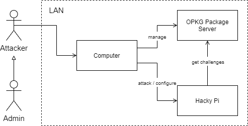

# Hacky Pi :robot:
This project is about providing a minimal Raspberry Pi image with opkg support which enables a user to install various **security challenge packages**.
The handout for the currently available challenges can be found [here](https://github.com/nimarty/hackypi-handout).


[](.github/CODE_OF_CONDUCT.md)

# Build Image
Following steps have been tested on Ubuntu 20.04 LTS. When using a virtual machine, make sure to have at least 2 CPUs and 50 GB disk space at your disposal. Anyways, the first BitBake build takes a while.
1. `./setup.sh`
1. `source poky/oe-init-build-env`
1. `bitbake hackypi-image`
1. take `<xxx>.rpi-sdimg` from `build/tmp/deploy/images/raspberrypi4/` and write it to an SD card
    1. `sudo fdisk -l | grep /dev/sd` to determine device
    1. `sudo dd if=<xxx>.rpi-sdimg of=/dev/sd<x> bs=4M` to write image on device
1. startup Raspberry Pi and connect via UART or SSH

# Build & install a package
1. `bitbake <PACKAGE_NAME>` to build a package
1. setup an opkg package server (e.g. this one: <https://github.com/nimarty/docker-private-opkg-repo>) which points to the ipk build directory.
1. configure the opkg repository on the Raspberry Pi. Change the following line at the bottom of `/etc/opkg/opkg.conf`
```
src/gz hackypackages http://<SERVER_URL>:<PORT>
```
1. run `opkg update` to update local package list
1. run `opkg install <PACKAGE_NAME> &> /dev/null` to install a package


# Network Setup



- Hacky Pi, Package Server and Attacker's/Admin's computer have to be in the same LAN
- The Admin configures the Hacky Pi by installing packages
- The Attacker tries to solve the challenge

# Contribute
If you want to help making this project even better, please read the [contribution guideline](.github/CONTRIBUTING.md) and our [code of conduct](.github/CODE_OF_CONDUCT.md), and start coding. Thanks in advance for your contribution!
