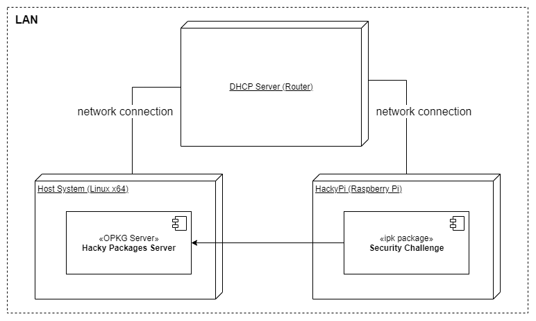

#  Hacky Pi 


Hacky Pi is a plattform to solve security challenges and train your cybersecurity skills. Because Hacky Pi is based on a Raspberry Pi, it offers a new dimension for security challenges to address problems found specifically in embedded devices. To solve a challenge it may be required to use an insecure serial connection or do some hardware manipulation... Find it out! 

> ℹ️ Hacky Pi is not some kind of device which allows you to attack other systems. It is a training platform.

# Getting Started
You will need a host system to run the Hacky Packages Server (OPKG Server) and to attack Hacky Pi. Hacky Pi needs a network connection in order to work. It is suggested to connect Hacky Pi and the host in an isolated network to prevent accidentally hacking the environment. 



## Setup Hacky Packages Server
To install and start the server you need a Linux host with docker. Windows is not currently supported.

`docker run --rm -p 8080:80 -d ghcr.io/nimarty/hackypackages-server:latest`

This will automatically pull the docker image and launch the package server in the background.

## Setup Hacky Pi
### Write image to SD card
1. Download the latest release package from this repo
1. Take `<xxx>.rpi-sdimg` from `images/raspberrypi4/` or `images/raspberrypi3/` and write it to an SD card.
    1. Under Linux: `sudo fdisk -l | grep /dev/sd` to determine device.
    1. Under Linux: `sudo dd if=<xxx>.rpi-sdimg of=/dev/sd<x> bs=4M` to write image on device.
    1. or under Windows, use Rufus or Win32DiskImager to write the image to an SD Card
1. Put the SD Card into your Raspberry Pi, connect it to your network and power it on

> ℹ️ First startup takes time as filesystem is expanded to available memory space (up to 10 minutes for slow SD cards). Be patient.

### Configure package repo
If the network is set up correctly, your Hacky Pi will get an IP address. Look it up on your DHCP server. To edit the opkg configuration you need to login via SSH as root.

<details>
  <summary>root password</summary>
  cG#e*n&5!kB3
</details>

1. `ssh root@<HACKYPI_IP>` 
1. `vi /etc/opkg/opkg.conf`
1. Change the following line at the bottom of the file. Use the IP address and port of the system running the Hacky Packages Server
```
src/gz hackypackages http://<SERVER_URL>:<PORT>
```
4. `opkg update`

## Solve Security Challenges 🤖
In order to install challenges, connect via SSH to Hacky Pi. Login as root.

> ℹ️ It's not the idea to use the root user to directly solve a security challenge. This is no fun. Follow the challenge description for the best experience.

1. `ssh root@<HACKYPI_IP>` 
1. `opkg install <CHALLENGE_NAME> &> /dev/null` and now you're ready to hack.
1. `opkg remove --autoremove <CHALLENGE_NAME>` to remove the challenge from Hacky Pi

A list of all available challenges with details can be found here: <https://github.com/nimarty/hackypi-handout>

> :warning: Install only one challenge at once. Installing more than one challenge at once can lead to errors.

# Development
## Build
Following steps have been tested on Ubuntu 20.04 LTS. When using a virtual machine, make sure to have at least 2 CPUs and 50 GB disk space at your disposal. Anyways, the first BitBake build takes a while.
1. `git clone https://github.com/nimarty/hackypi.git`
1. `cd hackypi`
1. `./setup.sh`
1. `source poky/oe-init-build-env`
1. `bitbake hackypi-image`

## Run Hacky Packages Dev Server
It's possible to start the server in a development mode. In development mode it loads packages from the build directory and the package list is updated periodically. See `.env` file for details. 
1. `git clone https://github.com/nimarty/hackypi.git`
1. `cd hackypi/tools/opkg-server` change to the directory with the docker compose file
1. `docker-compose up -d`

# Contribute
[](.github/CODE_OF_CONDUCT.md)

You're welcome to develop and add your own security challenge for Hacky Pi, please read the [contribution guideline](.github/CONTRIBUTING.md) and our [code of conduct](.github/CODE_OF_CONDUCT.md), and start coding.
